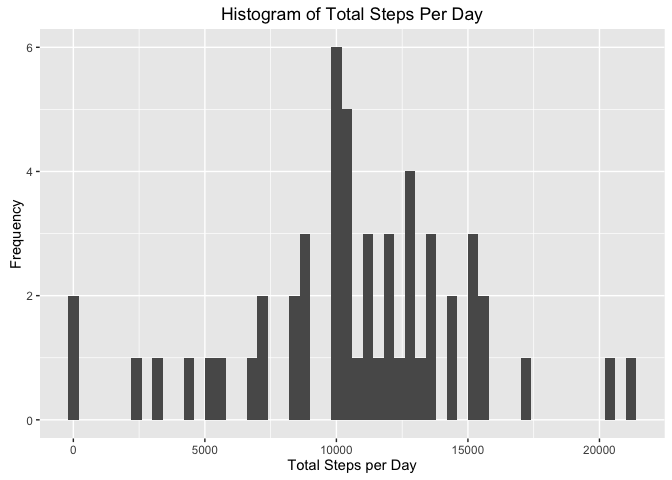
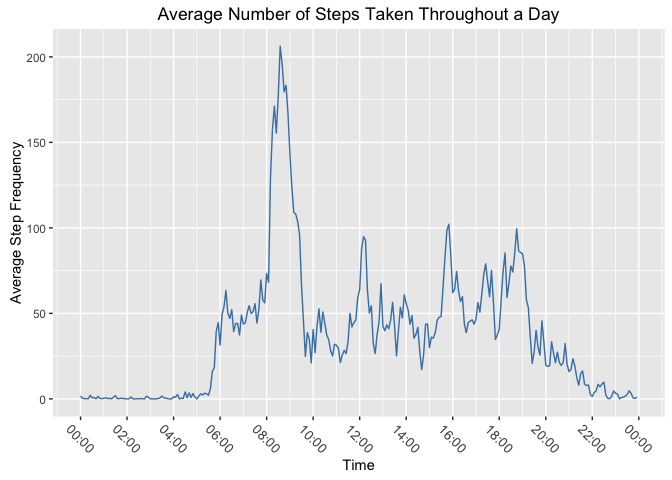
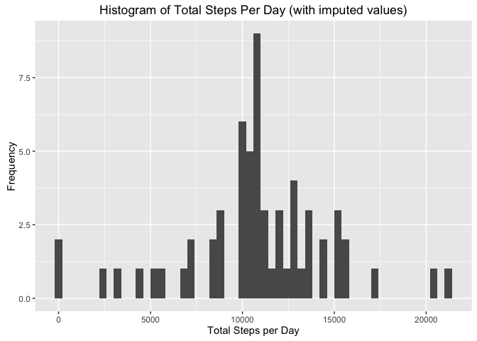
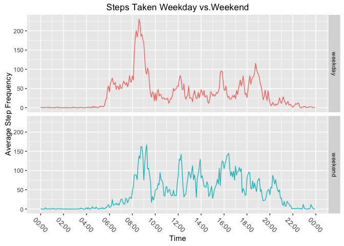

Reproducible Research: Peer Assesment 1
=======================================

#### Code for reading in the dataset and/or processing the data

``` r
library(ggplot2)
library(dplyr)
```

    ## 
    ## Attaching package: 'dplyr'

    ## The following objects are masked from 'package:stats':
    ## 
    ##     filter, lag

    ## The following objects are masked from 'package:base':
    ## 
    ##     intersect, setdiff, setequal, union

``` r
library(RColorBrewer)
library(ggthemes)
library(scales)
library(lubridate)


activity <- read.csv("~/Downloads/activity.csv", colClasses = c('numeric', 'Date', 'numeric'))

head(activity)
```

    ##   steps       date interval
    ## 1    NA 2012-10-01        0
    ## 2    NA 2012-10-01        5
    ## 3    NA 2012-10-01       10
    ## 4    NA 2012-10-01       15
    ## 5    NA 2012-10-01       20
    ## 6    NA 2012-10-01       25

``` r
str(activity)
```

    ## 'data.frame':    17568 obs. of  3 variables:
    ##  $ steps   : num  NA NA NA NA NA NA NA NA NA NA ...
    ##  $ date    : Date, format: "2012-10-01" "2012-10-01" ...
    ##  $ interval: num  0 5 10 15 20 25 30 35 40 45 ...

#### Histogram of the total number of steps taken each day

``` r
total.steps <- aggregate(steps ~ date, activity, sum)

qplot(total.steps$steps,
      main = "Histogram of Total Steps Per Day",
      xlab = 'Total Steps per Day', 
      ylab = "Frequency", 
      binwidth = 400)
```

<!-- -->

#### Mean and median number of steps taken each day

``` r
mean(total.steps$steps, na.rm = TRUE)
```

    ## [1] 10766.19

``` r
median(total.steps$steps, na.rm = TRUE)
```

    ## [1] 10765

#### Time series plot of the average number of steps taken

``` r
activity$Interval <- as.POSIXct(strptime(sprintf("%04d", activity$interval), "%H%M"))

avg.steps <- aggregate(x=list(steps=activity$steps), by=list(interval=activity$Interval), FUN = mean, na.rm=TRUE)


ggplot(data = avg.steps, aes(x=interval, y=steps)) + 
        geom_line(color = "steelblue") +
        theme(axis.text.x=element_text(angle = 315,
                                       hjust = 0.5,
                                       vjust = 0.5,
                                       size = 10))+
        ggtitle("Average Number of Steps Taken Throughout a Day") +
        scale_x_datetime(breaks = date_breaks("2 hour"),
                         labels = date_format("%H:%M", tz = "")) +
        xlab("Time")+
        ylab("Average Step Frequency")
```

<!-- -->

#### The 5-minute interval that, on average, contains the maximum number of steps

``` r
avg.steps[which.max(avg.steps$steps),]
```

    ##                interval    steps
    ## 104 2016-05-18 08:35:00 206.1698

#### Code to describe and show a strategy for imputing missing data

``` r
sum(is.na(activity$steps))
```

    ## [1] 2304

``` r
fillNA <- activity %>%
        group_by(Interval) %>%
        summarise(avg_steps = mean(steps, na.rm = TRUE)) %>%
        merge(activity, .) %>%
        mutate(steps = ifelse(is.na(steps)==TRUE, avg_steps, steps)) %>%
        select(-avg_steps)

sum(is.na(fillNA$steps))
```

    ## [1] 0

#### Histogram of the total number of steps taken each day after missing values are imputed

``` r
total.fillNA <- aggregate(x = list(steps = fillNA$steps) , 
                         by = list(date= fillNA$date),
                         FUN = sum, na.rm=TRUE)
head(total.fillNA)
```

    ##         date    steps
    ## 1 2012-10-01 10766.19
    ## 2 2012-10-02   126.00
    ## 3 2012-10-03 11352.00
    ## 4 2012-10-04 12116.00
    ## 5 2012-10-05 13294.00
    ## 6 2012-10-06 15420.00

``` r
qplot(total.fillNA$steps,
      main = "Histogram of Total Steps Per Day (with imputed values)",
      xlab = 'Total Steps per Day', 
      ylab = "Frequency", 
      binwidth = 400)
```

<!-- -->

``` r
mean(total.fillNA$steps)
```

    ## [1] 10766.19

``` r
median(total.fillNA$steps)
```

    ## [1] 10766.19

#### New data set with day factor with two levels (weekday and weekend)

``` r
daytype.function <- function(X) {
        daytype <- weekdays(X)
        if (daytype %in% c("Saturday", "Sunday"))
                return("weekend")
        else if (daytype %in% c("Monday", "Tuesday", "Wednesday", "Thursday", "Friday"))
                return("weekday")
}

final.data <- fillNA
final.data$date <- as.Date(final.data$date)
final.data$daytype <- sapply(final.data$date, FUN = daytype.function)

head(final.data)
```

    ##     Interval    steps       date interval daytype
    ## 1 2016-05-18 1.716981 2012-10-01        0 weekday
    ## 2 2016-05-18 0.000000 2012-11-23        0 weekday
    ## 3 2016-05-18 0.000000 2012-10-28        0 weekend
    ## 4 2016-05-18 0.000000 2012-11-06        0 weekday
    ## 5 2016-05-18 0.000000 2012-11-24        0 weekend
    ## 6 2016-05-18 0.000000 2012-11-15        0 weekday

#### Panel plot of data weekday vs. weekend

``` r
last.plot <- aggregate(steps ~ Interval + daytype, data = final.data, mean)

ggplot(last.plot, aes(x= Interval, y= steps, colour = daytype)) +
        geom_line() +
        facet_grid(daytype ~ .) +
        theme(legend.position="none", 
              axis.text.x=element_text(angle = 315,
                                       hjust = 0.5,
                                       vjust = 0.5,
                                       size = 10)) + 
        ggtitle("Steps Taken Weekday vs.Weekend") +
        scale_x_datetime(breaks = date_breaks("2 hour"),
                         labels = date_format("%H:%M", tz = "")) +
        xlab("Time")+
        ylab("Average Step Frequency")
```

<!-- -->
